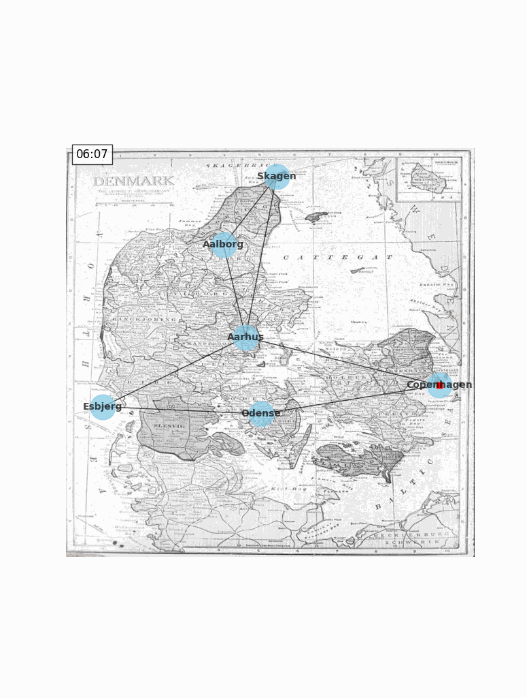

# rail-visualizer
Code for Programming, Algorithms and Data Structures [KAN-CDSCO2402U]. The project allows users to map and animate train travel within Denmark.

Example output from `src/rail_network_data.json`:

    

